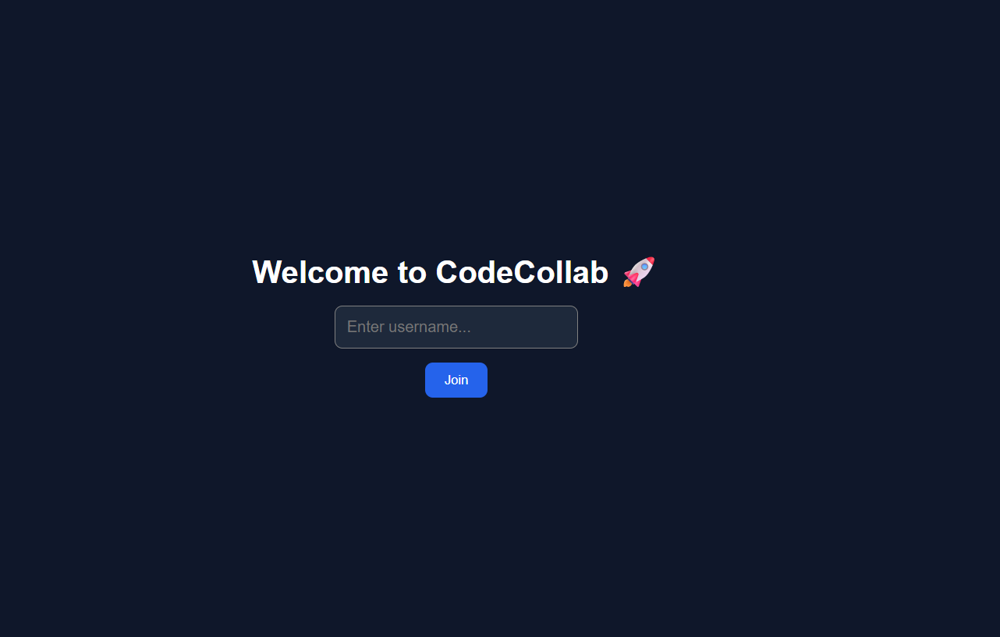
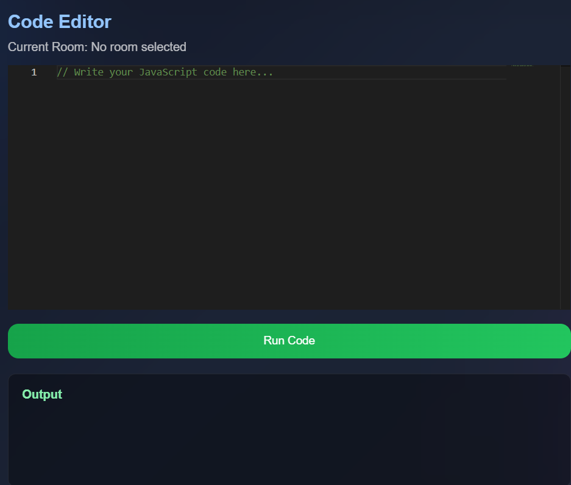
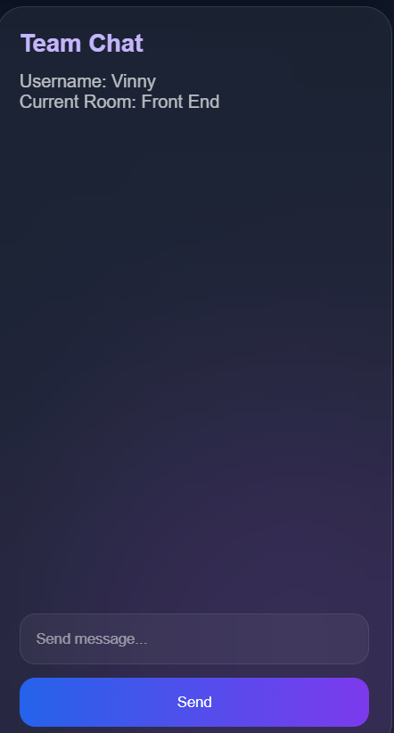
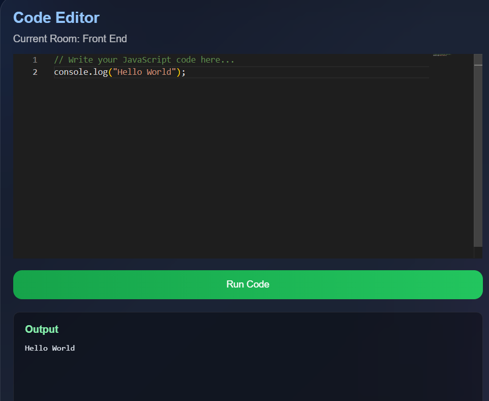

# CodeCollab

A real-time collaborative coding platform where multiple users can join rooms, write code together, chat, and execute JavaScript code.

## Project Overview

CodeCollab allows developers to collaborate in real time through shared coding rooms. Users can join rooms, edit code simultaneously, communicate through chat, and execute JavaScript code directly from the browser.

The project demonstrates real-time communication using Socket.IO, frontend development with React, backend development with Node.js and Express, and database integration using MongoDB.

## Features

### Room Management

* Create collaboration rooms
* Join existing rooms
* Work with room-specific code sessions

### Real-Time Code Collaboration

* Multiple users can edit code simultaneously
* Changes are synchronized instantly using Socket.IO
* Room-based code sharing

### Code Editor

* Monaco Editor integration
* Syntax highlighting
* VS Code-like editing experience

### Real-Time Chat

* Communicate with other users in the same room
* Instant message delivery using Socket.IO

### Code Execution

* Execute JavaScript code directly from the browser
* View output inside the application

### Database Integration

* Store room information using MongoDB
* Persistent room management

## System Architecture

The application follows a client-server architecture.

```text
+-------------+
|    User     |
+-------------+
       |
       v
+-------------+
| React Client|
+-------------+
       |
       | REST API + Socket.IO
       v
+------------------+
| Node.js Backend  |
| Express Server   |
+------------------+
       |
       v
+-------------+
|  MongoDB    |
+-------------+
```

### Frontend

The frontend is built using React and Vite. It provides:

* Room management interface
* Monaco code editor
* Real-time chat interface
* Code execution controls

### Backend

The backend is built using Node.js, Express, and Socket.IO. It is responsible for:

* Managing rooms
* Handling real-time communication
* Processing code execution requests
* Interacting with MongoDB

### Database

MongoDB stores room information and supports persistent room management.

## Project Structure

```text
CODECOLLAB
│
├── client
│   ├── src
│   │   ├── components
│   │   │   ├── Chat.jsx
│   │   │   ├── Editor.jsx
│   │   │   ├── Navbar.jsx
│   │   │   └── Sidebar.jsx
│   │   │
│   │   ├── App.jsx
│   │   └── main.jsx
│   │
│   ├── public
│   └── package.json
│
├── server
│   ├── index.js
│   └── package.json
│
└── README.md
```

### Folder Responsibilities

#### client/

Contains the React frontend application.

#### client/src/components/

Reusable UI components used throughout the application.

#### Chat.jsx

Handles real-time messaging between users in a room.

#### Editor.jsx

Provides the Monaco code editor and code execution functionality.

#### Sidebar.jsx

Manages room creation, room listing, and room selection.

#### Navbar.jsx

Displays the application's navigation interface.

#### server/

Contains the backend application.

#### index.js

Main server entry point responsible for:

* Express server setup
* Socket.IO configuration
* MongoDB connection
* Room APIs
* Code execution APIs

#### README.md

Project documentation and setup guide.

## Installation and Setup

### Prerequisites

Before running the project, make sure the following are installed:

* Node.js
* npm
* MongoDB Atlas account
* Git

### Clone the Repository

```bash
git clone <repository-url>
cd CODECOLLAB
```

### Frontend Setup

Navigate to the client folder:

```bash
cd client
```

Install dependencies:

```bash
npm install
```

Start the frontend:

```bash
npm run dev
```

The frontend will run on:

```text
http://localhost:5173
```

### Backend Setup

Open a new terminal.

Navigate to the server folder:

```bash
cd server
```

Install dependencies:

```bash
npm install
```

Start the backend:

```bash
node index.js
```

The backend will run on:

```text
http://localhost:5000
```

### Database Setup

Create a MongoDB Atlas cluster and obtain the connection string.

Update the MongoDB connection string inside:

```text
server/index.js
```

Start the backend again after updating the connection string.

## Running the Application

After starting both the frontend and backend servers:

### Step 1: Open the Application

Visit:

```text
http://localhost:5173
```

### Step 2: Enter a Username

Provide a username to access the collaboration environment.

### Step 3: Create or Join a Room

* Create a new room using the room creation input.
* Or join an existing room from the room list.

### Step 4: Collaborate in Real Time

Open the application in multiple browser tabs or devices.

Verify that:

* Code changes appear instantly for all connected users.
* Room-based collaboration works correctly.

### Step 5: Test the Chat System

Send messages from one user and verify that they appear for other users in the same room.

### Step 6: Execute JavaScript Code

Write JavaScript code inside the editor.

Click:

```text
Run Code
```

Verify that the output is displayed correctly in the output section.

### Expected Behavior

* Users in the same room share code changes.
* Chat messages are delivered instantly.
* Room management functions correctly.
* JavaScript code executes successfully.

## Troubleshooting

### CORS Error

Example:

```text
Access to XMLHttpRequest has been blocked by CORS policy
```

Cause:

* Frontend URL is not allowed by the backend CORS configuration.

Solution:

* Verify the Socket.IO and Express CORS configuration.
* Ensure the frontend deployment URL is included in the allowed origins.

### Socket.IO Connection Issues

Symptoms:

```text
WebSocket connection failed
```

Possible Causes:

* Backend server is not running.
* Incorrect backend URL in the frontend.
* Render service is sleeping or unavailable.

Solution:

* Verify the backend deployment URL.
* Check Render deployment status.
* Confirm Socket.IO client and server URLs match.

### localhost API Errors

Example:

```text
GET http://localhost:5000/... net::ERR_CONNECTION_REFUSED
```

Cause:

* Frontend still contains local development URLs after deployment.

Solution:

Replace:

```text
http://localhost:5000
```

with:

```text
https://your-backend-url.onrender.com
```

for production deployments.

### MongoDB Connection Issues

Symptoms:

* Rooms fail to load.
* Backend crashes during startup.

Solution:

* Verify the MongoDB Atlas connection string.
* Ensure network access is configured correctly.
* Confirm database credentials are valid.

### Deployment Issues

If changes are not visible after deployment:

1. Verify GitHub push was successful.
2. Verify Render deployment completed successfully.
3. Verify Vercel deployment completed successfully.
4. Perform a hard refresh in the browser.

## Deployment Guide

The application is deployed using:

* GitHub for source code management
* Render for backend hosting
* Vercel for frontend hosting
* MongoDB Atlas for database hosting

### Backend Deployment (Render)

1. Push backend code to GitHub.
2. Create a new Web Service in Render.
3. Connect the GitHub repository.
4. Configure the backend service.
5. Add the MongoDB Atlas connection string.
6. Deploy the service.

Example backend URL:

```text id="rdr6aq"
https://your-backend.onrender.com
```

### Frontend Deployment (Vercel)

1. Push frontend code to GitHub.
2. Import the repository into Vercel.
3. Configure the frontend project.
4. Deploy the application.

Example frontend URL:

```text id="8j5j1w"
https://your-project.vercel.app
```

### Production Configuration

Before deploying the frontend, replace local development URLs:

Development:

```text id="qjlwm9"
http://localhost:5000
```

Production:

```text id="lbzc83"
https://your-backend.onrender.com
```

### Deployment Workflow

```text id="g0tysj"
Code Changes
      ↓
Git Add
      ↓
Git Commit
      ↓
Git Push
      ↓
GitHub
      ↓
Render Redeploys Backend
      ↓
Vercel Redeploys Frontend
      ↓
Application Updated
```

## Future Improvements

The following enhancements may be added in future versions of CodeCollab:

* User authentication and authorization
* Private collaboration rooms
* Persistent chat history
* Persistent code storage
* Multi-language code execution
* User presence indicators (online/offline status)
* Room invitation system
* File upload and sharing
* Code version history
* Collaborative whiteboard support
* Dark/Light theme switching
* Syntax support for additional programming languages


## Screenshots

### Home Screen



### Collaborative Editor



### Chat System



### Code Execution Output


